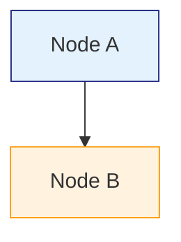
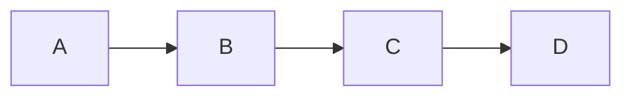
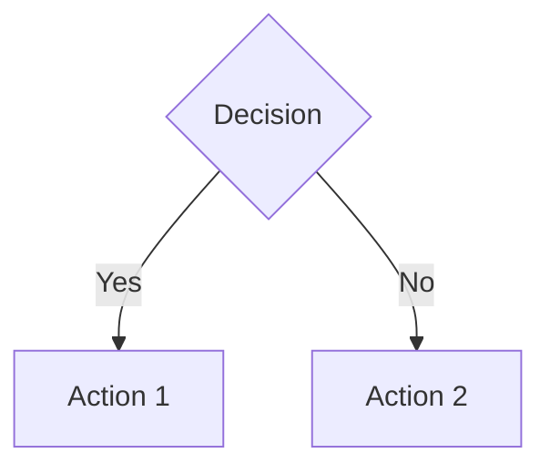
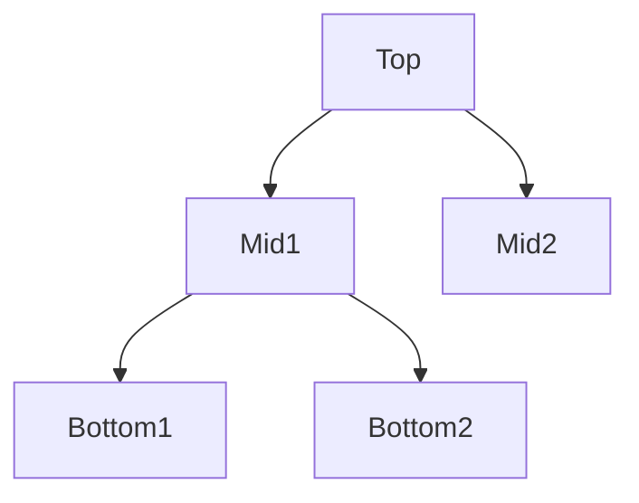
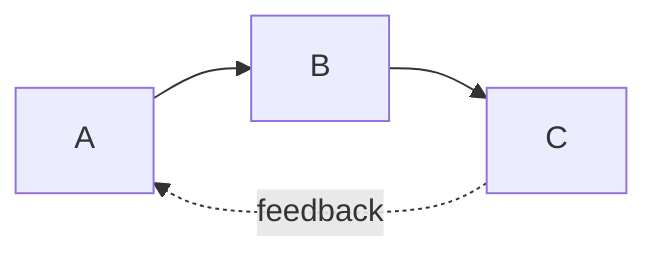

# 🎨 Customization Guide

## Quick Customization Checklist

### 1. Update Site Information (5 minutes)

Edit `content.md` - Site Configuration section:

```markdown
## Site Configuration
**Title:** YOUR-PROJECT-NAME
**Subtitle:** Your Subtitle Here
**Tagline:** Your compelling tagline
**Header:** Your Header Text
```

### 2. Update Links (2 minutes)

Edit `content.md` - Footer section:

```markdown
**Links:**
- [GitHub](https://github.com/YOUR_USERNAME/YOUR_REPO)
- [Paper](https://arxiv.org/YOUR_PAPER)
- [Models](https://huggingface.co/YOUR_USERNAME/YOUR_MODEL)
```

### 3. Customize Colors (Optional)

Edit `styles.css` - Change the color scheme:

```css
:root {
    --primary-blue: #1a237e;      /* Main titles */
    --light-blue: #e3f2fd;        /* Backgrounds */
    --accent-blue: #5c6bc0;       /* Accents */
    --text-dark: #263238;         /* Body text */
    --text-light: #546e7a;        /* Secondary text */
    --border-color: #b0bec5;      /* Borders */
    --code-bg: #263238;           /* Code blocks */
}
```

#### Color Scheme Examples:

**Green Theme:**
```css
--primary-blue: #1b5e20;
--light-blue: #e8f5e9;
--accent-blue: #66bb6a;
```

**Purple Theme:**
```css
--primary-blue: #4a148c;
--light-blue: #f3e5f5;
--accent-blue: #9c27b0;
```

**Orange Theme:**
```css
--primary-blue: #e65100;
--light-blue: #fff3e0;
--accent-blue: #ff9800;
```

## Content Editing Patterns

### Add a New Architecture Component

```markdown
---
## Architecture: Your Component Name

Brief description of what this component does.

- **Key Feature 1** — Explanation
- **Key Feature 2** — Explanation
- **Key Feature 3** — Explanation

Conclusion paragraph explaining why this matters.

\`\`\`mermaid
graph LR
    A[Input] --> B[Your Component]
    B --> C[Output]
\`\`\`
```

### Add a New Use Case

```markdown
### Your Use Case Title
Description of the use case and how SHARINGAN-DEEP solves it.
```

### Add a Performance Metric

```markdown
**YOUR_NUMBER** | Metric Name | Additional context or note
```

### Add a Technical Spec

```markdown
**Component Name:** Technical details and specifications
```

## Diagram Customization

### Mermaid Diagram Styles

You can customize diagram colors inline:



### Common Diagram Patterns

**Linear Flow:**


**Decision Tree:**


**Hierarchical:**


**Circular/Feedback:**


## Typography Customization

Edit `styles.css` to change fonts:

```css
body {
    font-family: 'Your Font', -apple-system, BlinkMacSystemFont, sans-serif;
}

/* Headings */
h1, h2, h3 {
    font-family: 'Your Heading Font', sans-serif;
}

/* Code */
.code-block pre {
    font-family: 'Your Code Font', 'Courier New', monospace;
}
```

### Google Fonts Example

Add to `<head>` in `index.html`:
```html
<link href="https://fonts.googleapis.com/css2?family=Inter:wght@400;600;700&display=swap" rel="stylesheet">
```

Then in `styles.css`:
```css
body {
    font-family: 'Inter', sans-serif;
}
```

## Layout Customization

### Change Container Width

Edit `styles.css`:
```css
.container {
    max-width: 1200px;  /* Default: 1100px */
}
```

### Adjust Section Spacing

```css
section {
    margin-bottom: 5rem;  /* Default: 4rem */
}
```

### Modify Component Card Style

```css
.component {
    background: #ffffff;     /* Default: #fafafa */
    border-radius: 12px;     /* Default: 8px */
    box-shadow: 0 2px 8px rgba(0,0,0,0.1);  /* Add shadow */
}
```

## Advanced: Add New Section Types

### 1. Define in content.md

```markdown
---
## Your New Section Type

Content here...
```

### 2. Add Parser Logic (parser.js)

```javascript
// In parseSection method, add:
else if (fullTitle === 'Your New Section Type') {
    type = 'your-section';
}

// In render method, add:
case 'your-section':
    this.renderYourSection(section);
    break;

// Add render method:
renderYourSection(section) {
    // Your custom rendering logic
}
```

### 3. Add HTML Container (index.html)

```html
<section class="your-section">
    <h2 id="your-section-title"></h2>
    <div id="your-section-content"></div>
</section>
```

### 4. Add Styles (styles.css)

```css
.your-section {
    /* Your custom styles */
}
```

## Mobile Responsiveness

The site is already responsive, but you can adjust breakpoints:

```css
@media (max-width: 768px) {
    /* Tablet styles */
}

@media (max-width: 480px) {
    /* Mobile styles */
}
```

## Tips for Best Results

1. **Keep it simple** - Don't over-customize
2. **Test locally** - Always preview before pushing
3. **Maintain consistency** - Use the same patterns throughout
4. **Optimize images** - Keep file sizes small
5. **Check mobile** - Test on different screen sizes

## Common Customizations

### Add a Logo

1. Add logo image to `docs/images/logo.png`
2. Edit `index.html` header:
```html
<header>
    <div class="container">
        
        <div class="header-subtitle" id="header-text"></div>
    </div>
</header>
```

### Add Social Links

Edit `content.md` Footer:
```markdown
**Links:**
- [GitHub](https://github.com/...)
- [Twitter](https://twitter.com/...)
- [Discord](https://discord.gg/...)
```

### Add Analytics

Add to `index.html` before `</head>`:
```html
<!-- Google Analytics -->
<script async src="https://www.googletagmanager.com/gtag/js?id=YOUR_ID"></script>
<script>
  window.dataLayer = window.dataLayer || [];
  function gtag(){dataLayer.push(arguments);}
  gtag('js', new Date());
  gtag('config', 'YOUR_ID');
</script>
```

---

**Questions?** Check the main README.md or open an issue!
