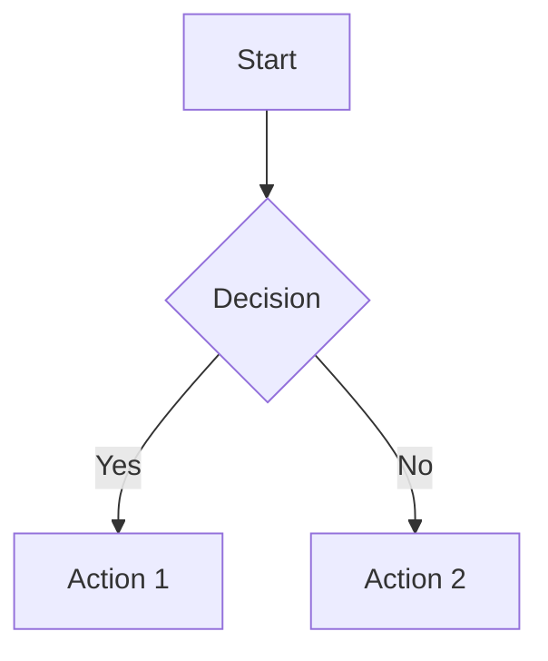
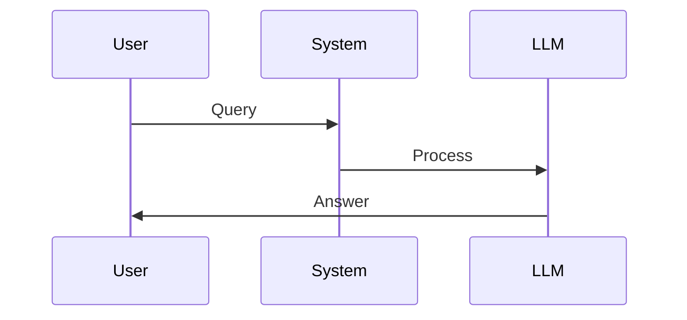

# SHARINGAN-DEEP Website

A beautiful, simple documentation website for SHARINGAN-DEEP architecture.

## 🎯 Super Simple Content Editing

**Just edit `content.md`** - that's it! No HTML, no JavaScript, no complex configuration.

### What You Can Do in content.md:

1. **Change any text** - titles, descriptions, explanations
2. **Add/remove bullet points** - just use `- ` for lists
3. **Update code examples** - wrap in triple backticks with language
4. **Add Mermaid diagrams** - wrap in triple backticks with `mermaid`
5. **Modify sections** - add new `## Section Name` headers
6. **Update links** - use `[Text](URL)` format

### Example Edits:

```markdown
## Architecture: Your New Component

This is a description of your new component.

- **Feature 1** — Description here
- **Feature 2** — Another description

Here's a diagram:

\`\`\`mermaid
graph LR
    A[Input] --> B[Process]
    B --> C[Output]
\`\`\`
```

## 📁 File Structure

```
docs/
├── index.html       # Main HTML (don't touch)
├── styles.css       # Styling (customize colors if needed)
├── parser.js        # Content parser (don't touch)
├── content.md       # ✨ EDIT THIS FILE ✨
└── README.md        # This file
```

## 🚀 Deploy to GitHub Pages

### Step 1: Push to GitHub

```bash
git add docs/
git commit -m "Add SHARINGAN-DEEP website"
git push origin main
```

### Step 2: Enable GitHub Pages

1. Go to your repository on GitHub
2. Click **Settings** → **Pages**
3. Under "Source", select **main** branch
4. Under "Folder", select **/docs**
5. Click **Save**

### Step 3: Access Your Site

Your site will be live at:
```
https://yourusername.github.io/repository-name/
```

## 🎨 Customization

### Change Colors

Edit `styles.css` and modify the CSS variables:

```css
:root {
    --primary-blue: #1a237e;      /* Main heading color */
    --light-blue: #e3f2fd;        /* Background highlights */
    --accent-blue: #5c6bc0;       /* Accent color */
    --text-dark: #263238;         /* Body text */
    --text-light: #546e7a;        /* Secondary text */
}
```

### Add Custom Sections

In `content.md`, just add a new section:

```markdown
---
## Your New Section

Content goes here...
```

The parser will automatically render it!

## 📊 Mermaid Diagram Syntax

### Flow Chart


### Sequence Diagram


### More Examples
- [Mermaid Documentation](https://mermaid.js.org/)

## 🔧 Local Development

### Option 1: Python Server
```bash
cd docs
python -m http.server 8000
```
Visit: http://localhost:8000

### Option 2: VS Code Live Server
1. Install "Live Server" extension
2. Right-click `index.html`
3. Select "Open with Live Server"

## 📝 Content Guidelines

### Writing Style (from your reference image):
- **Clear and direct** - No fluff
- **Professional but accessible** - Technical without being dense
- **Use em-dashes** — Like this for emphasis
- **Bold key terms** - Make important concepts stand out
- **Short paragraphs** - Easy to scan

### Section Structure:
1. **Title** - Clear, descriptive
2. **Introduction** - What is this?
3. **Details** - Bullet points or paragraphs
4. **Conclusion** - Why it matters
5. **Diagram** (optional) - Visual explanation

## 🐛 Troubleshooting

### Diagrams not showing?
- Check Mermaid syntax is correct
- Ensure triple backticks use `mermaid` language tag
- View browser console for errors

### Content not updating?
- Hard refresh: `Ctrl+Shift+R` (Windows) or `Cmd+Shift+R` (Mac)
- Clear browser cache
- Check `content.md` syntax (no unclosed quotes, etc.)

### GitHub Pages not working?
- Wait 2-3 minutes after enabling (build time)
- Check Settings → Pages shows "Your site is live"
- Verify `/docs` folder is selected as source

## 📚 Resources

- [Markdown Guide](https://www.markdownguide.org/)
- [Mermaid Diagrams](https://mermaid.js.org/)
- [GitHub Pages Docs](https://docs.github.com/en/pages)

## 💡 Tips

1. **Preview locally** before pushing to GitHub
2. **Keep content.md organized** with clear section separators (`---`)
3. **Use diagrams sparingly** - only where they add value
4. **Test on mobile** - site is responsive
5. **Update links** in Footer section to your actual URLs

---

**Need help?** Open an issue or check the documentation above.
